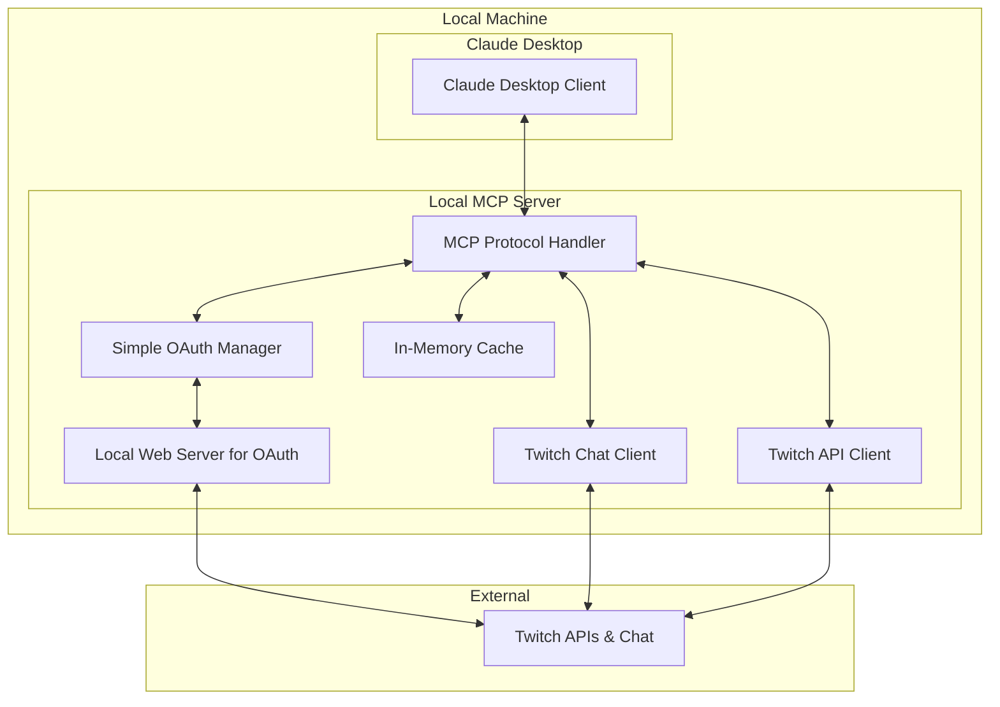

# Design Document

## Overview

The enhanced Twitch MCP server is designed as a **local-only** tool that runs alongside Claude Desktop, focusing on simplicity and ease of use. The server provides enhanced Twitch chat interaction capabilities through MCP's Resources, Tools, and Prompts while maintaining a lightweight, single-user architecture.

The design prioritizes simple OAuth authentication, reliable chat functionality, and gradual feature enhancement without complex infrastructure or external dependencies.

## Architecture

### High-Level Architecture (Local MCP Server)



### Core Components

#### 1. MCP Protocol Handler
- **Purpose**: Handle MCP communication with Claude Desktop
- **Responsibilities**: 
  - MCP message routing and protocol compliance
  - Resource, tool, and prompt registration
  - Simple request/response handling

#### 2. Simple OAuth Manager
- **Purpose**: Easy Twitch authentication for local use
- **Responsibilities**:
  - Launch local web server for OAuth callback
  - Handle Twitch OAuth flow with browser redirect
  - Store tokens securely in local config
  - Automatic token refresh

#### 3. Twitch Integration Layer
- **Purpose**: Direct connection to Twitch services
- **Responsibilities**:
  - IRC chat connection with auto-reconnect
  - Twitch Helix API calls
  - Basic rate limiting and error handling
  - In-memory caching for performance

## Components and Interfaces

### MCP Resources (Simplified)

#### Basic Stream Resource
```typescript
interface StreamResource {
  uri: "twitch://stream/{channel}";
  name: "Stream Information";
  mimeType: "application/json";
  data: {
    isLive: boolean;
    viewerCount: number;
    game: string;
    title: string;
    startedAt?: string;
  };
}
```

#### Chat History Resource
```typescript
interface ChatHistoryResource {
  uri: "twitch://chat/{channel}/history";
  name: "Recent Chat Messages";
  mimeType: "application/json";
  data: {
    messages: Array<{
      username: string;
      message: string;
      timestamp: string;
      badges: string[];
    }>;
    totalMessages: number;
    timeframe: string;
  };
}
```

### MCP Tools (Simplified)

#### Basic Chat Tools
```typescript
interface SendMessageTool {
  name: "send_twitch_message";
  description: "Send a message to Twitch chat";
  inputSchema: {
    channel: string;
    message: string;
  };
}

interface ObserveChatTool {
  name: "observe_twitch_chat";
  description: "Observe Twitch chat for a specified duration";
  inputSchema: {
    channel: string;
    duration?: number; // milliseconds, default 60000
  };
}
```

#### Stream Information Tools
```typescript
interface GetStreamInfoTool {
  name: "get_stream_info";
  description: "Get current stream information";
  inputSchema: {
    channel: string;
  };
}

interface GetChannelInfoTool {
  name: "get_channel_info";
  description: "Get channel information and recent activity";
  inputSchema: {
    channel: string;
  };
}
```

### MCP Prompts (Simplified)

#### Chat Analysis Prompts
```typescript
interface ChatSummaryPrompt {
  name: "summarize_chat";
  description: "Summarize recent chat activity";
  arguments: [
    {name: "messages", description: "Recent chat messages", required: true},
    {name: "timeframe", description: "Time period covered", required: true}
  ];
}

interface StreamContextPrompt {
  name: "stream_context";
  description: "Provide context about current stream";
  arguments: [
    {name: "streamInfo", description: "Current stream information", required: true},
    {name: "recentActivity", description: "Recent chat activity", required: false}
  ];
}
```

## Data Models (Simplified)

### Core Data Models

#### Chat Message Model
```typescript
interface ChatMessage {
  id: string;
  username: string;
  displayName: string;
  message: string;
  timestamp: Date;
  channel: string;
  badges: string[];
  emotes?: Record<string, string>;
  isAction: boolean;
}
```

#### Stream Info Model
```typescript
interface StreamInfo {
  channelName: string;
  isLive: boolean;
  title?: string;
  game?: string;
  viewerCount?: number;
  startedAt?: Date;
  language?: string;
}
```

#### OAuth Token Model
```typescript
interface TwitchTokens {
  accessToken: string;
  refreshToken: string;
  expiresAt: Date;
  scopes: string[];
  username: string;
}
```

## Error Handling (Simplified)

### Error Categories and Responses

#### Authentication Errors
```typescript
interface AuthenticationError {
  type: "authentication_error";
  code: "INVALID_TOKEN" | "EXPIRED_TOKEN" | "OAUTH_FAILED";
  message: string;
  suggestedAction: "Re-authenticate via browser" | "Check token permissions" | "Restart OAuth flow";
}
```

#### Connection Errors
```typescript
interface ConnectionError {
  type: "connection_error";
  service: "twitch_chat" | "twitch_api";
  message: string;
  retryable: boolean;
  retryAfter?: number;
}
```

#### Simple Rate Limiting
- Basic exponential backoff for API calls
- Queue chat messages when rate limited
- Clear user feedback when delays occur

## Testing Strategy (Simplified)

### Unit Testing
- **Core Components**: Test MCP handlers, OAuth flow, chat client independently
- **Mock Dependencies**: Use mock Twitch API responses for consistent testing
- **Error Scenarios**: Test authentication failures, connection drops, rate limits

### Integration Testing
- **MCP Protocol**: Verify Claude Desktop can communicate with server
- **OAuth Flow**: Test complete authentication process with browser
- **Chat Integration**: Validate message sending/receiving with Twitch

### Manual Testing
- **User Experience**: Test OAuth setup process for ease of use
- **Chat Functionality**: Verify real-time chat observation and messaging
- **Error Recovery**: Test reconnection and token refresh scenarios

## Security Considerations (Local Focus)

### Local Authentication
- **OAuth 2.0 Flow**: Standard Twitch OAuth with local callback server
- **Token Storage**: Secure local storage with encryption at rest
- **Minimal Scopes**: Request only necessary permissions (chat:read, chat:write)

### Local Data Handling
- **No External Storage**: All data stays on local machine
- **Memory-Only Cache**: Chat history stored only in memory during session
- **No User Tracking**: No persistent user data collection

### Network Security
- **HTTPS Only**: All API calls use HTTPS
- **Local Callback**: OAuth callback only accepts localhost connections
- **Rate Limiting**: Respect Twitch API limits to avoid account issues

## Performance Optimization (Local)

### Simple Caching
- **In-Memory Cache**: Basic caching for stream info and recent chat messages
- **TTL-Based**: Simple time-based cache expiration
- **Memory Limits**: Prevent excessive memory usage with size limits

### Local Performance
- **Single Process**: Simple single-threaded design for local use
- **Efficient Reconnection**: Quick reconnection to Twitch chat on disconnects
- **Minimal Dependencies**: Keep the server lightweight and fast to start

### Resource Management
- **Connection Pooling**: Reuse HTTP connections for API calls
- **Message Buffering**: Buffer chat messages to prevent overwhelming Claude
- **Graceful Shutdown**: Clean up connections and save state on exit